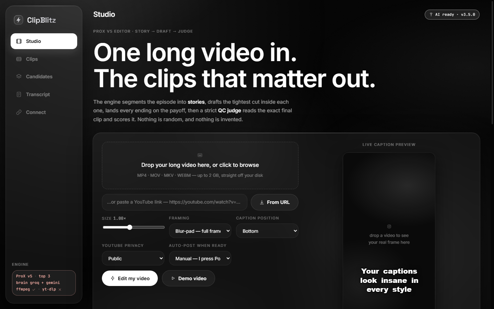
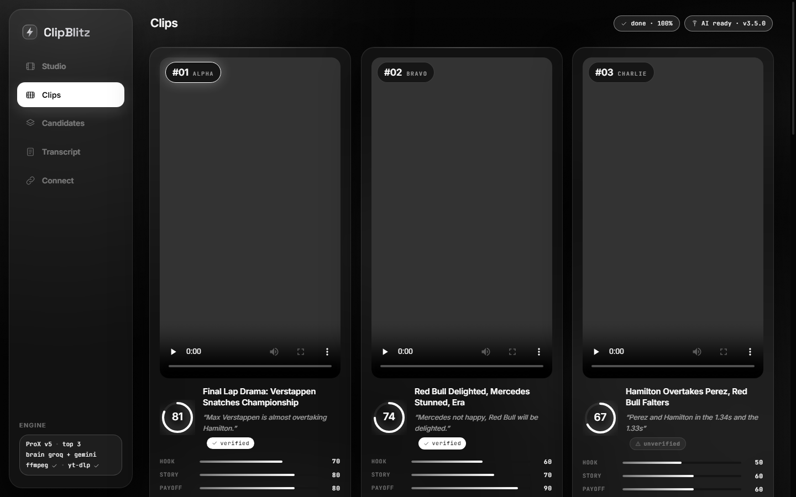
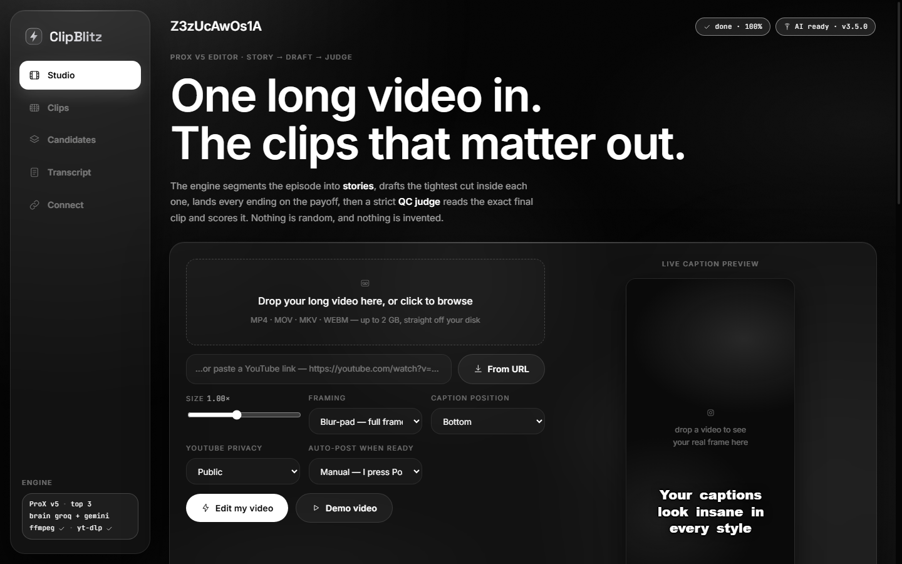
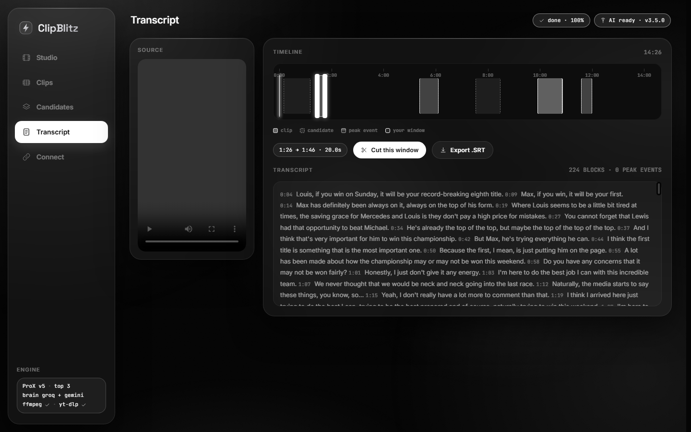
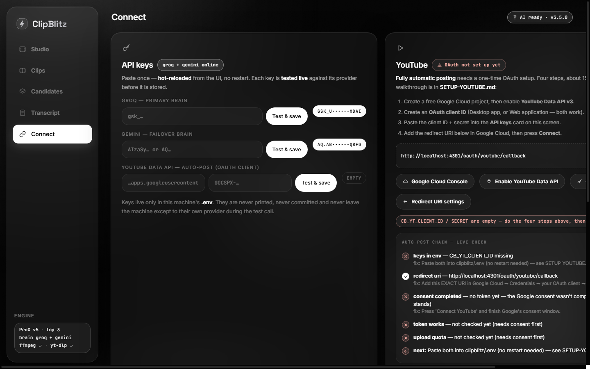

# ClipBlitz — AI Shorts Factory

> **Long video in → top clips out.** Paste a YouTube link or drop a file. The engine reads the
> transcript, finds the *stories*, cuts each clip so it starts on a real sentence and ends on a
> payoff, and a second pass judges the finished clip and shows its verdict on the card. Vertical
> 9:16, blur-pad framing, word-by-word captions, AI-written titles and hashtags, optional YouTube
> posting.

Your own OpusClip — self-hosted, no watermark, no per-minute fees, honest scores.

**Version:** v3.5.0 · **Engine:** ProX v5 "The AI Editor" · **UI:** Obsidian Keynote (monochrome glass)

**New here? Read the [BEGINNER-GUIDE.md](BEGINNER-GUIDE.md)** — it assumes you have never used a
terminal or GitHub, and walks you from zero to your first clip.

---

## Quickstart

```bash
# 1. the two helper tools (ffmpeg + yt-dlp) into bin/ — one time
powershell -ExecutionPolicy Bypass -File scripts\fetch-tools.ps1   # Windows
bash scripts/fetch-tools.sh                                        # macOS / Linux / Git Bash

# 2. run it
python run.py                                                      # → http://localhost:4301
```

Open <http://localhost:4301>. The first screen asks for a key — paste a free Groq key
([console.groq.com/keys](https://console.groq.com/keys)) into the **API keys** card and press
**Test & save**. Then: **Studio** → paste a link or drop a file → **Edit my video**.

No key handy? The **Demo** button generates a test video so you can watch the whole pipeline work.

### Screenshots

| Studio | Clips podium |
|---|---|
|  |  |

| Candidates | Transcript |
|---|---|
|  |  |



---

## The ProX v5 pipeline

```
video ─▶ audio ─▶ Whisper word-level transcription (auto-chunked for long videos)
              ─▶ acoustic laughter detection
              ─▶ PEAK MOMENT mining (audio roar + camera-cut density + drama heat)
    ┌─────────┴──────────────────────────────────────────────┐
    │ 1. STORY PASS    the episode is segmented into         │
    │                  self-contained stories                │
    │ 2. DRAFT PASS    the tightest 15-60s cut is drafted    │
    │                  INSIDE each story, full context       │
    │ 3. EDGE RULES    snap to sentences · no filler starts  │
    │                  · end on punctuation · ride the laugh │
    │ 4. JUDGE PASS    the exact final clip is judged:       │
    │                  does it stand alone? abrupt edges?    │
    │                  → one repair redraw, then demotion    │
    │ 5. SCORE v2      the judge's ratings of that exact cut │
    │                  + measured laughter/energy/pacing     │
    └─────────┬──────────────────────────────────────────────┘
              └─▶ render 9:16 (blur-pad) + captions + metadata + post
```

Every clip card carries its **factor bars** (Hook / Story / Payoff / Energy / Pacing / Event /
Laugh) and the **judge's verdict line** — the score follows the content, nothing is invented.
Clips that do not fully pass are labelled **unverified** rather than dressed up.

The podium also enforces *shape*: one cut per story, picks spread across the timeline, and no two
clips with near-identical titles.

---

## The screens

- **Studio** — YouTube URL or dropped file, caption-style gallery with a live 9:16 preview,
  framing, recent jobs, processing timeline.
- **Clips** — the podium: rank badges, score dials, verified/unverified QC badges, hook quote,
  judge verdict, factor bars, metadata editor, post buttons.
- **Candidates** — every runner-up with its measured score, filters (All / Verified / Peak events),
  one-click render.
- **Transcript** — timestamped blocks with peak highlights, waveform timeline with markers,
  drag-to-cut window, Export .SRT.
- **Connect** — API keys in the UI (Groq / Gemini / YouTube with live tests), YouTube auto-post
  wizard with a readiness checklist and Diagnose, assisted platform cards, post queue.

---

## Keys live in the app, not in a file

Every key is managed on the **Connect** screen: paste it, press **Test & save**, and ClipBlitz calls
the provider live to confirm it works before storing it. Keys hot-reload — no restart, ever.
`.env.example` documents the optional knobs (port, data folder, model overrides).

**Dual brain:** Groq is the primary; add a free Gemini key and throttled calls fail over
automatically. Retired models self-heal — if a provider renames a model, ClipBlitz picks up the
successor from the error and retries.

---

## Social posting

- **YouTube — automatic** once you complete the one-time OAuth setup (the Connect screen walks you
  through it with deep links into each Google Cloud page, a copy-ready redirect URI, and a live
  five-step diagnostic). Free quota ≈ 6 uploads/day. See [SETUP-YOUTUBE.md](SETUP-YOUTUBE.md).
- **TikTok / Instagram / Facebook / X — assisted**: the caption package is copied to your clipboard
  and the upload page opens.

---

## Zero-framework core

Pure Python standard library on the server (no FastAPI/Flask), bundled ffmpeg + yt-dlp, the Whisper
API for transcription, and a hand-written HTML/CSS/JS front end with self-hosted fonts (no CDN, no
animation library, no build step). A `Dockerfile` is included.

---

## Docs

- **[BEGINNER-GUIDE.md](BEGINNER-GUIDE.md)** — zero-knowledge install and walkthrough (start here)
- [SETUP-YOUTUBE.md](SETUP-YOUTUBE.md) — the OAuth wizard, click by click, with error fixes
- [FIXED.md](FIXED.md) — the honest changelog: every bug found and what it does now
- [.env.example](.env.example) — every setting documented

## Development checks

```bash
python scripts/smoke.py        # offline end-to-end: demo video → stories → cut → captions
python scripts/e2e_check.py    # live end-to-end against a running server
python scripts/route_check.py  # every HTTP route answers as expected
python scripts/ui_check.py     # static front-end sweep (dangling refs, banned patterns)
```

## License

See the repository for licensing. Clips you make are yours; respect the rights of the videos you
process.