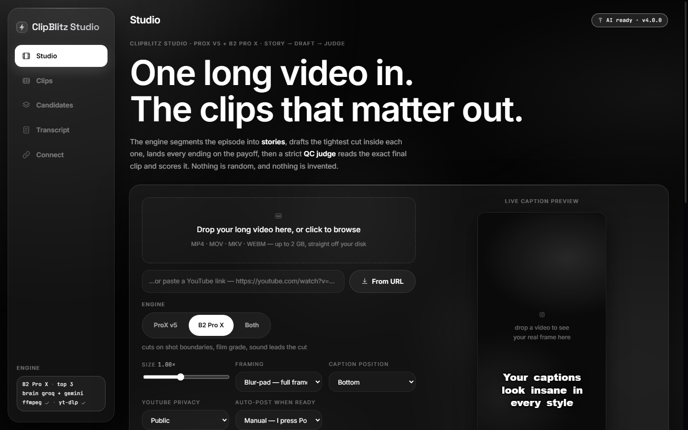
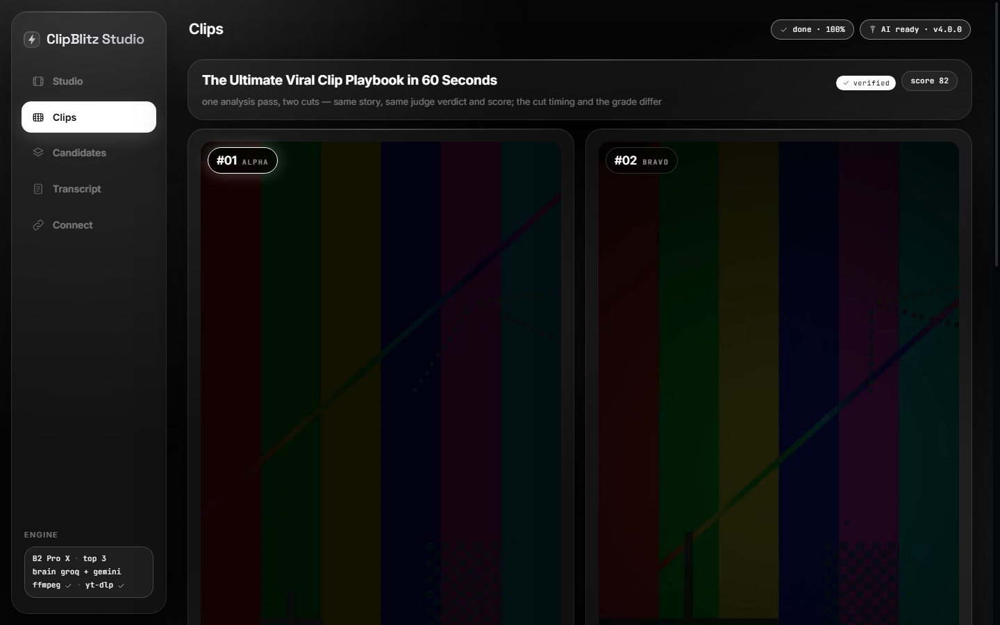
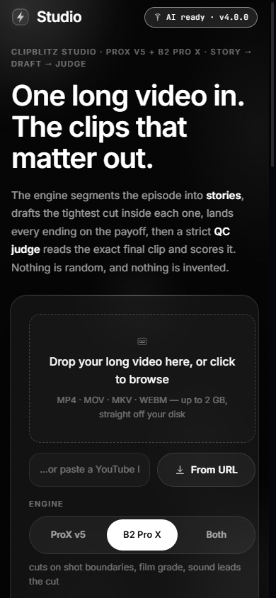
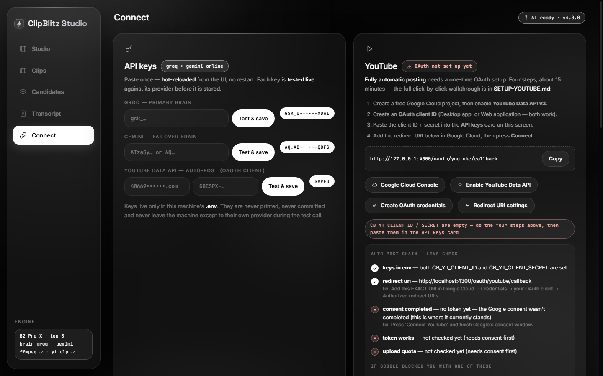

# ClipBlitz — AI Video Clipping Studio

<p align="center">
  
</p>

<p align="center">
  
</p>

<p align="center">
  <b>One long video in. The clips that matter out.</b><br />
  Your own OpusClip — self-hosted, zero watermark, zero monthly fees, honest scores.
</p>

<p align="center">
  <a href="https://github.com/agra-aarav15/clipblitz-ai-shorts/releases/tag/v4.1.0"><b>Download v4.1.0 Release</b></a> ·
  <a href="studio/SETUP.md"><b>Setup &amp; Phone Guide</b></a> ·
  <a href="BEGINNER-GUIDE.md"><b>Absolute Beginner Guide</b></a> ·
  <a href="SETUP-YOUTUBE.md"><b>YouTube Auto-Post</b></a>
</p>

---

## What is this

ClipBlitz is an AI-powered video editor that turns podcasts, interviews, gaming sessions, and long YouTube videos into viral, vertical shorts ready for YouTube Shorts, TikTok, and Instagram Reels.

Unlike tools that blindly split videos every 30 seconds, ClipBlitz thinks like a professional human editor:

1. **Story pass** — segments the episode into complete, self-contained stories (setup, build-up, punchline/payoff).
2. **Draft pass** — drafts the tightest 15-60s cut inside each story, prioritizing regions with audience laughter and vocal energy.
3. **Deterministic edge rules** — snaps starts to sentence boundaries (no "um", "so", or mid-word starts) and rides endings through audience reactions.
4. **Strict QC judge** — an independent LLM pass reads the exact final transcript of the cut and issues a pass/fail verdict (`verified` vs `unverified`).
5. **Traceable score v2** — computed strictly from the judge's ratings and acoustic factors (energy, laughter, pacing). No fake numbers.

---

## What's new in v4.1.0

- **Use it from an AI agent.** `studio/plugin/` is a plugin for a coding agent — Claude Code and
  any other MCP client. Hand it a video and say *"cut me four clips"* and it runs the real engine
  and returns the rendered vertical files with titles, hooks, scores and the reason each was
  picked. It only edits: there is no publish tool, on purpose.
- **Copyright safety, measured.** A claim-risk report per job (third-party-looking audio spans
  with timestamps, where the source came from, a missing or expired licence, clips carrying the
  fewest transformative layers), a licence record next to your rights answer, and a written edit
  receipt with hashes. It tells you the truth; it does not promise claim immunity, because
  nothing can.
- **Both engines now learn separately.** Past its own evidence bar, each engine's kept cuts pull
  that engine's weights away from the shared profile, on top of the global taste model — see
  [A learning loop that stays on your machine](#a-learning-loop-that-stays-on-your-machine).

---

## Two engines in one window (ClipBlitz Studio v4.1.0)

Both flagship engines live in a single interface with side-by-side comparison:

| Engine | How it cuts | Look & Feel | Audio |
|---|---|---|---|
| **ProX v5** | Story-first + sentence snap + QC judge | Clean 1080x1920 vertical blur-pad | 0.18s fade in/out |
| **B2 Pro X** | Shot-boundary snap + scene grammar | Cinematic film grade (S-curve + vignette) | J-cut: audio leads picture by 0.35s |
| **Both** | **One analysis pass, two cuts side by side** | Compare both grades and timings | Pick your favorite cut |

<p align="center">
  
</p>

---

## Works on any fresh PC — and on your phone

<p align="center">
  
  &nbsp;&nbsp;&nbsp;&nbsp;&nbsp;&nbsp;&nbsp;&nbsp;
  
</p>

- **One-click fresh-PC install:** `START.bat` checks for Python and installs it silently if missing. Bundled `ffmpeg` and `yt-dlp` ship inside the release zip — nothing else is downloaded.
- **Use it from your phone:** Open the printed `http://192.168.x.x:4300` address in your mobile browser. The computer does all the heavy video rendering; your phone controls the studio and previews the clips. Add to Home Screen for a native app feel.
- **Hardware-aware protection:** The host machine is measured (CPU cores, RAM, ffmpeg). Weak devices are told immediately: *"This device can't render clips. Use your laptop or PC to render them."* — avoiding mid-render crashes.

---

## Rights Guardrails — post what you have the right to post

ClipBlitz makes the safe path the easy path and makes a risky post loud. It never touches
content matching: there is no pitch shift, speed change, mirror or fingerprint trick anywhere in
the code, because those are circumvention — Content ID finds unlicensed re-uploads anyway, and
trying to dodge it is what gets channels terminated.

- **One-time rights gate.** Before the first automatic upload from a job, the Clips screen asks
  whether the material is your own, licensed, or a transformative fair-use edit, with an honest
  note on each. The answer is stored on the job and shown on it. Auto-post waits for it; the clip
  file is never withheld, so posting by hand stays the owner's call.
- **Source awareness.** A job started from a YouTube link records the uploader channel and video
  id (from the yt-dlp metadata the download already fetched) and shows them on every clip card,
  flagging the clip when that is not the channel you connected for posting.
- **Transformative-edit badge.** Rendered clips list the layers the render actually applied —
  captions burned into the picture, vertical reframing, the film grade, the J-cut — as one line,
  so a fair-use claim is anchored to something real and verifiable.
- **Claim-risk report.** What can honestly be measured before a clip goes anywhere: sustained
  non-speech audio outside the transcript (the shape of a music bed, theme or intro sting, with
  its timestamps), a source downloaded from a channel you may not own, an unrecorded or expired
  licence, and any clip carrying fewer transformative layers than the rest of the set.
- **Licence record and edit receipt.** `POST /api/job/<id>/licence` stores who granted what, with
  a reference and an expiry; `GET /api/job/<id>/receipt` writes the manifest — exact window of
  every cut, the engine that rendered it, the work that render applied, and sha256 hashes of the
  source and each output file. A claim is argued with paperwork, not with memory.

<p align="center">
  
</p>

Clipping **your own** long videos is always safe and is the primary use case. Other people's
material needs a licence or genuine fair use — and no tool can make somebody else's work
uncopyrighted, because a content-matching system matches the work itself. Full text:
**Copyright and strikes** in [studio/SETUP.md](studio/SETUP.md).

## A learning loop that stays on your machine

Every choice on a finished clip — posted, re-rendered from the Candidate Lab, hand-cut on the
Transcript timeline — is logged to a local `data/learning.json`, together with that clip's
measured factor breakdown and the candidate pool it was chosen from. Three layers learn from
those choices, each with its own evidence bar:

| Layer | Needs | Moves |
|---|---|---|
| Global taste | 10 choices | payoff / hook / pacing / story, up to **10% per factor** |
| Per engine | 15 choices **on that engine** | that engine only, up to 5% more, so B2 and ProX can drift apart into what each does best for you |
| Factor over-index | 8 choices that carried a candidate pool | the measured factor your kept cuts beat their own pool on, up to 6% |

Recent choices count more than old ones (half as much after 45 days), so the engine follows your
taste instead of being haunted by your first week. Below a threshold nothing moves, so a fresh
install ranks exactly like the shipped engine, and a `both`-engines run always scores on the
shared profile because one analysis pass has exactly one ranking. The Connect screen shows the
real counts, shares, medians and the plain-language *why* behind every multiplier in effect, with
a Reset button. No cloud, no external service, no extra scope on
the YouTube OAuth consent (`youtube.upload` cannot read Analytics, so view/retention feedback is
intentionally not pulled rather than silently widening what the app is allowed to do).

---

## Use it from an AI agent

The engine is not tied to the window. `studio/plugin/` is a plugin for an agent runtime —
Claude Code through its `--plugin-dir` flag, or any MCP client — and it exposes the same cuts
the app makes.

```
python -m clipblitz.agent cut episode.mp4 --clips 4 --json   # one shot, prints the clips as JSON
python -m clipblitz.agent risk <job_id>                      # what to check before publishing
python -m clipblitz.agent receipt <job_id>                   # write and show the edit receipt
python -m clipblitz.agent mcp                                # the MCP server itself, on stdio
```

Tools: `cut_clips`, `job_status`, `job_clips`, `risk_report`, `edit_receipt`, `learning_state`.
If a Studio is listening on `127.0.0.1:4300` the job goes through its own HTTP API — one writer
for `data/jobs.json`; if nothing is listening, the identical pipeline runs in-process. Either way
the agent feeds the same local learning store you train by hand. There is no publish tool: editing
is the plugin's job, and publishing stays a human decision made in front of the rights gate.

The ready-to-run Windows release carries `studio/plugin/` next to the EXE, and the EXE is the
same entry point, so the agent path needs no Python installed either: `ClipBlitzStudio.exe --mcp`
serves the identical MCP server on stdio, and `ClipBlitzStudio.exe --tools` prints the schemas.

---

## Quickstart

### Option A: Ready-to-run release (recommended)
1. Download **`ClipBlitzStudio-4.1.0.zip`** from [Releases](https://github.com/agra-aarav15/clipblitz-ai-shorts/releases/tag/v4.1.0).
2. Unzip the folder anywhere.
3. Double-click **`START.bat`** (Windows) or run `bash start.sh` (macOS / Linux / Termux).
4. Open `http://localhost:4300` in your browser.

### Option B: Clone from source
```bash
git clone https://github.com/agra-aarav15/clipblitz-ai-shorts.git
cd clipblitz-ai-shorts/studio

# Fetch the bundled ffmpeg + yt-dlp (one time)
powershell -ExecutionPolicy Bypass -File scripts\fetch-tools.ps1   # Windows
bash scripts/fetch-tools.sh                                        # macOS / Linux

# Run the studio
python run.py                                                      # -> http://localhost:4300
```

Paste your free Groq key ([console.groq.com/keys](https://console.groq.com/keys)) into the **API keys** card, drop a video or paste a YouTube URL, and press **Edit my video**. No keys? Press **Demo video** for a generated end-to-end test run.

---

## Project Layout

```
studio/                 # Flagship ClipBlitz Studio (port 4300) — both engines, phone-ready
  run.py                # Studio server entry point
  START.bat             # One-click Windows launcher (silent Python install)
  start.sh              # macOS / Linux / Termux launcher
  clipblitz/            # Unified engine (pipeline, virality, cinema, rights, agent, server)
  web/                  # Obsidian Keynote UI (monochrome glass, PWA manifest, self-hosted fonts)
  plugin/               # Agent plugin: MCP server, /cut command, skill
  android/              # Android WebView companion app source
  SETUP.md              # Complete guide for fresh PCs, phones, and Termux
clipblitz/              # Classic ClipBlitz v3.5 (ProX v5 engine only, port 4301)
b2prox/                 # Classic B2 Pro X (Cinematic engine only, port 4302)
docs/shots/             # Unaltered, real screenshots of every screen
BEGINNER-GUIDE.md       # Zero-terminal guide for non-developers
SETUP-YOUTUBE.md        # YouTube Data API v3 OAuth walkthrough
```

---

## Technology

- **Backend:** Pure Python 3 standard library `ThreadingHTTPServer`. Zero pip packages required to run from source.
- **Frontend:** Pure HTML5, CSS3, vanilla JavaScript. Zero build steps, zero npm, zero external CDNs.
- **Typography:** Self-hosted `Inter`, `JetBrains Mono`, and `Space Grotesk` woff2 fonts.
- **Video:** Bundled `ffmpeg 9.0.1` and `yt-dlp`. Blur-pad 9:16 framing, ASS word-pop subtitle animations.
- **AI Dual-Brain:** Groq (`openai/gpt-oss-120b` or `llama-3.3-70b`) as primary brain + Google Gemini (`gemini-2.0-flash`) as automatic failover.

---

## License

MIT License. Free to use, modify, and self-host for personal and commercial projects.
