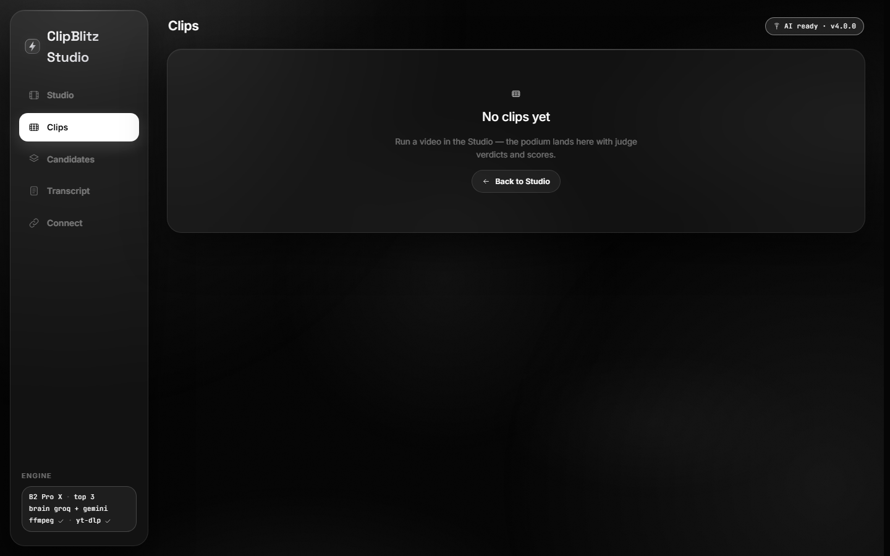
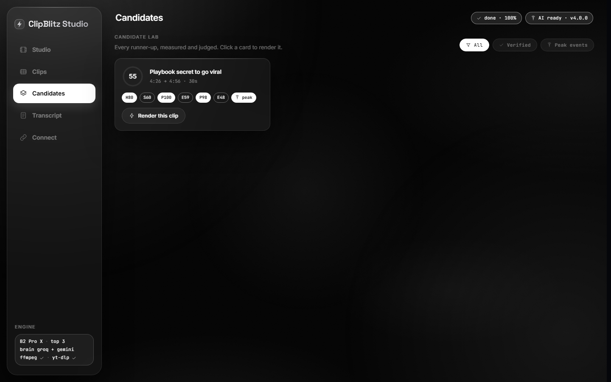
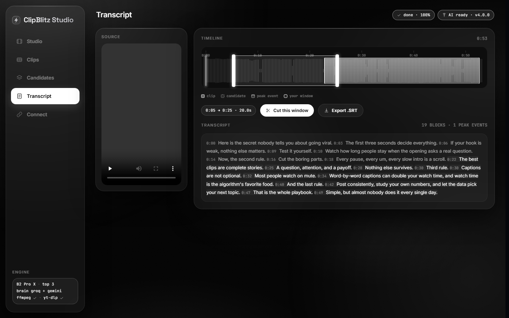

<p align="center">
  
</p>

# ClipBlitz Studio

**Two AI clipping engines in one window.** Drop one long video; choose **ProX v5**, **B2 Pro X**,
or **Both** — and get vertical shorts with real edits, honest scores and animated captions.
Runs on any fresh PC and on your phone over Wi-Fi. Pure Python standard library, self-hosted
fonts, no build step, no CDN, no tracking.

- **ProX v5** — the story-first engine: segments the episode into stories, drafts the tightest
  cut inside each, lands every ending on the payoff, then a strict QC judge reads the exact
  final clip and scores it. Verified cuts are badged; anything else says "unverified".
- **B2 Pro X** — the cinematic engine on the same spine: cuts land on real shot boundaries,
  payoffs land on the shot that carries them, a film grade (S-curve, vignette) is applied, and
  the sound leads the cut (J-cut) so the incoming clip pulls you in.
- **Both** — one analysis pass, two cuts per moment, side by side. Same story, same judge
  verdict and score; the cut timing and the grade differ. Compare and pick.


## Run it

Windows: double-click **`START.bat`** (installs Python silently if the machine has none).
macOS / Linux / Termux: `bash start.sh`. Full guide: **[SETUP.md](SETUP.md)**.

```
ClipBlitz Studio v4.2.0 (engines: ProX v5 / B2 Pro X / Both) → http://localhost:4300
  your phone (same Wi-Fi)  http://192.168.31.103:4300
```

The startup lines above are the whole install: ffmpeg and yt-dlp ship in `bin\`, the UI and
fonts are served locally, and your API keys live only in this machine's `.env`.


## What is honest here

- Every score comes from the QC judge reading the exact final cut plus measured audio
  (laughter, energy, pacing). Factor breakdowns are on every card.
- The hardware readout is measured, not invented: cores, memory and an ffmpeg check run on the
  host. A device that cannot render says so **before** any job starts — "This device can't
  render clips. Use your laptop or PC to render them." — instead of crashing mid-render.
- A phone used as the controller renders nothing; the studio host does. That is why the phone
  experience has no hardware tension. Running the engine *on* an Android phone is supported
  via Termux (`bash start.sh`) and the same hardware check applies there.

## Rights, on purpose

Before the first automatic upload from a job, the Clips screen asks the one question that
actually matters: is this your own content, licensed, or a transformative fair-use edit? Your
answer is stored on the job and the post waits for it. The clip file is never withheld, so
posting by hand stays the owner's call. A job started from a YouTube link also shows the
uploader channel and video id on every clip card and flags it when that is not the channel you
connected.

There is deliberately no evasion here: no pitch shift, speed change, mirror or fingerprint
trick. Content ID finds unlicensed re-uploads anyway, and hiding from it is what gets channels
terminated. See the **Copyright and strikes** section in [SETUP.md](SETUP.md).

## Copyright safety, measured

`GET /api/job/<id>/risk` returns what can honestly be measured about a job before it goes
anywhere: sustained non-speech audio outside your transcript (the shape of a music bed, theme
or intro sting, with its timestamps), a source downloaded from somewhere you may not own (with
the uploader yt-dlp reported), a missing or expired licence, an unanswered rights gate, and any
clip that carries fewer transformative layers than the rest of the set. Every flag is a
measurement taken from data the pipeline already produced, and none of it is a legal verdict.

`POST /api/job/<id>/licence` stores the licence record next to your rights answer — who granted
it, a reference, an expiry date — because a claim is argued with paperwork, not memory.

`GET /api/job/<id>/receipt` writes the edit receipt: the exact window of every cut, the engine
that rendered it, the transformative work that render actually applied (burned-in captions, the
reframe, the grade, the J-cut), and sha256 hashes of the source and each output file.

`GET /api/job/<id>/certificate` bundles all of it — the risk report, the licence record, the
edit receipt and the sha256 of the source and every render — into one artifact with its own
digest, written to `data/certificates/`. Anyone can re-check it against the files without
trusting this studio:

```
python scripts/verify_certificate.py data/certificates/<job>.json --root data
```

The **clearance gate** is the other half of the same idea. Advisory is the shipped default and
keeps exactly the behaviour above: the report measures, publishing asks first, a render is
never held. With `CB_RIGHTS=strict` imported media stops even earlier — nothing renders and
nothing publishes until you answer the rights question or record an **override with a written
reason**, which is stored on the job and quoted in the certificate. No clearance ever happens
automatically, and the demo video the studio generates itself is exempt. Every import is also
recorded in `data/sources.json` (where it came from, its size, a quick identity, the jobs it
fed), and the Clips screen shows the gate's mode, its current state and the certificate button
next to the rights panel; `GET /api/gate` exposes the same read to anything else.

What none of it does is make somebody else's video uncopyrighted. A content-matching system
matches the work itself, so no crop, caption or re-encode removes the match, and this studio
will not ship a button that pretends otherwise.



## What I've learned (local, honest)

Every clip you post, re-render from the Candidate Lab or hand-cut on the Transcript screen is
one logged choice. Three layers learn from those choices, each with its own evidence bar:

| Layer | Needs | Moves |
|---|---|---|
| Global taste | 10 choices | payoff/hook/pacing/story, up to 10% per factor |
| Per engine | 15 choices **on that engine** | that engine only, up to 5% more, so B2 and ProX can drift apart into what each does best for you |
| Factor over-index | 8 choices that carried a candidate pool | the measured factor your kept cuts beat their own pool on, up to 6% |

Older choices count for less (half as much after 45 days), so the engine follows your taste
instead of being haunted by your first week. Below a threshold nothing moves, so a fresh install
ranks exactly like the shipped engine, and a `both`-engines run always scores on the shared
profile because one analysis pass has exactly one ranking. The Connect screen shows the real
counts, shares, medians and the plain-language *why* behind every multiplier in effect, with a
Reset button. The store is a local `data/learning.json`; nothing is uploaded and there is no
cloud training.

A fourth layer sits on top of those three: the trained model (`clipblitz/trainer.py`). It is a
local pairwise ranker over the same measured factors, pre-trained on this install's own judge
verdicts and post-trained on your real choices. It only activates when the newest fifth of your
choices says it ranks the kept cut above the candidates it beat, at 0.55 or better, and it
moves ranking weights by at most 6% per factor inside the same 10% cap. Every fit is one line
in `data/model_log.json`; a fit that cannot prove itself leaves the previous model exactly as
it was. Re-train on demand from the card, `run.py --train`, `POST /api/train` or the
`train_model` agent tool. With `CB_LAB=0` the whole layer is off and the studio behaves exactly
like v4.1.0.


## Scout the next video (metadata only)

The **Scout** screen answers "what should I cut next?" without touching a single byte of
media. Type a niche and the bundled yt-dlp answers with metadata only — titles, channels,
view counts, publish dates, durations. Every result is measured into six features: velocity
(views/day, log scale), reach, freshness (30-day half-life), duration fit around the
~20-minute sweet spot, curiosity signals actually present in the title, and channel fit from
your own `data/jobs.json`. Nothing is imputed: a field the source did not report stays
unmeasured, is shown as unmeasured, and is excluded from the score.

Judging a proposal is one click — **Make** or **Pass**. Each call is stored with the features
measured at judgment time, and pairwise evidence is mined from it (within one search, every
make against every pass), then fit with the same deterministic core as the taste model: the
newest fifth is held out, and a scout model activates only at 0.55+ make-beats-pass and
strictly above the incumbent, one line per attempt in `data/scout_model_log.json`. An active
model shifts a proposal's score by at most 8 points — it never touches a render.

**Make this** is the only place the scout causes a download: it records your make first and
then runs the normal import, so the whole rights layer applies exactly as it always does.
The **judgment queue** also offers the strongest evidence the taste model can get — the same
moment cut by both engines in one `both` job — for a real kept-versus-rejected call with
measured factors on both sides.

From a terminal or an agent: `python -m clipblitz.agent scout "podcast clips"`, or the
`scout_search` and `scout_queue` MCP tools — an agent can search and read the queue, but it
never judges for you. `CB_SCOUT=off` turns the scout off, `CB_LAB=0` removes all of it, and
`GET /api/scout` plus `POST /api/scout/search|judge|make` are the API underneath.

## ClipBench — the scoreboard

Every ranking claim in this studio gets scored on the same held-out pairs by
`clipblitz/clipbench.py`. It reads the stores, changes nothing and writes no model. Each
family faces the split its own model is gated on — the newest fifth of the pairs, chronological
— and every contender is scored on exactly those pairs:

| Family | Baseline | Fixed, never learns | Learned |
|---|---|---|---|
| Taste (judge verdicts + your choices) | `virality` — the mean of the measured factors | `one-shot` — one plausible weight set, chosen once | `taste-model`, when one is active |
| Scout (make/pass calls) | `measured` — the mean of the measured features | `one-shot` — reach and freshness, nothing else | `scout-model`, when one is active |

Accuracy is strict pairwise: the contender has to rank the kept cut above the one it beat. **A
tie is not a win** — so a constant scorer scores 0.00 and a coin flip is the 0.50 reference —
and every row carries its pair count and tie count next to the number. Below six held-out pairs
the row says `insufficient evidence` instead of printing something flattering, and with no
active model the board scores the baselines only and says so. The verdict line is allowed to
report that the learned model **lost**. Same data in, same board out.

Run it from the Scout screen, `GET /api/clipbench` (last board) or `POST` (run now), `python
run.py --bench`, `python -m clipblitz.agent clipbench`, or the `clipbench` MCP tool.
`CB_CLIPBENCH=off` switches the board off; `CB_LAB=0` removes it with the rest of the lab.

## The two engines, technically

One codebase, branched per job — B2 Pro X is a strict superset of ProX v5:

| | ProX v5 | B2 Pro X |
|---|---|---|
| Cut boundaries | story + edge rules (sentence starts, laugh endings) | the same, snapped to measured shot boundaries and re-timed to scene grammar |
| Look | clean 1080x1920 blur-pad | S-curve grade, vignette, optional grain |
| Sound | fade in/out | J-cut: audio leads the picture by 0.35s |
| Extra passes | — | scene map + motion map (cached per video) |

`both` runs the analysis once and renders each moment twice — the ProX cut from the
pre-cinema bounds, the B2 cut from the cinema-snapped bounds.

## Layout

```
run.py            one entry point, port 4300 (CLI arg > CB_PORT > default)
START.bat         one-click Windows launcher (auto-installs Python if missing)
start.sh          macOS / Linux / Termux launcher
clipblitz/        the engine package (pipeline, virality, cinema, rights, scout, clipbench, agent, server, ...)
web/              the single-file UI (vanilla HTML/CSS/JS, self-hosted fonts, PWA manifest)
plugin/           the agent plugin: MCP server, /cut command, skill (see plugin/README.md)
bin/              bundled ffmpeg + yt-dlp — nothing is ever downloaded at runtime
data/             jobs.json + clips + uploads (created on first run; never commit it)
SETUP.md          fresh PC, phone, Termux, YouTube OAuth
```

Ports on this machine: Studio **4300**, classic ClipBlitz 4301, B2 Pro X 4302 (they can run
side by side; each is self-contained).

## The other two screens





## Verify it yourself

Health, capability and LAN endpoints (the server is stdlib `ThreadingHTTPServer`):

```
curl http://localhost:4300/api/health      # engines, measured hardware, brains
curl http://localhost:4300/api/lan         # the phone address
```

Or press **Demo video** in the Studio — a generated test video runs the full pipeline
(transcribe, mine, judge, render) with whichever engine you selected.

The engine split and the learning loop have their own offline test scripts (stdlib only, no
network, no ffmpeg):

```
python scripts/test_engines.py    # prox-only == legacy ProX v5, b2-only untouched, both honest
python scripts/test_learning.py   # weights inert below 10 choices, +/-10% cap, rights gate holds
python scripts/test_agent.py      # MCP framing, tool honesty, risk/licence/receipt, both engines learn apart
python scripts/test_trainer.py    # pretrain/post-train pairs, deterministic fit, holdout gate, CB_LAB off
python scripts/test_rights.py     # gate modes, source registry, override record, hold/resume, certificate + verifier
python scripts/test_scout.py      # metadata-only fetch, measured features, judgment pairs, holdout gate, MCP + CLI
python scripts/test_clipbench.py  # same split as the gate, ties are not wins, a losing model is reported as losing
python scripts/test_marketplace.py # one-command install, plugin manifest, tool table == code, bundle hygiene
```

## Use it from an agent

`plugin/` is a plugin for a coding agent: hand it a video and a number and it cuts the clips.

```
python -m clipblitz.agent cut episode.mp4 --clips 4 --json    # one shot, prints JSON
python -m clipblitz.agent risk <job_id>                       # what to check before publishing
python -m clipblitz.agent receipt <job_id>                    # write and show the edit receipt
python -m clipblitz.agent certificate <job_id>                # write and show the clearance certificate
python -m clipblitz.agent scout "podcast clips"               # metadata-only discovery for a niche
python -m clipblitz.agent clipbench --run                     # score every ranking claim on held-out pairs
python -m clipblitz.agent mcp                                 # the MCP server itself, on stdio
```

Install it in one command — `sh plugin/install.sh` or `plugin\install.bat` registers the
marketplace this repo publishes (`.claude-plugin/marketplace.json`, entry `clipblitz-studio`)
and installs the plugin; with no `claude` on PATH it prints the two commands to run by hand.
Working on the checkout itself, `claude --plugin-dir <studio>\plugin` loads it in place.

The MCP server exposes `cut_clips`, `job_status`, `job_clips`, `risk_report`, `edit_receipt`,
`learning_state`, `train_model`, `clearance_certificate`, `scout_search`, `scout_queue` and
`clipbench`.
If a Studio is listening on 127.0.0.1 it creates the job
through its own HTTP API (one writer for `data/jobs.json`); if not, the identical pipeline runs
in-process. `train_model` fits the local taste model and reports the gate decision; `scout_search`
and `scout_queue` are the metadata-only discovery surface; `clipbench` runs the scoreboard.
There is no publish tool and no judge tool, on purpose: editing is the plugin's job, the scout's
Make/Pass and keep-versus-reject calls stay in the studio, and publishing stays a human decision.

The ready-to-run Windows release carries `plugin/` next to the EXE, and the EXE is the same
entry point, so no Python is needed for the agent path either:

```
ClipBlitzStudio.exe --mcp      # the MCP server on stdio, exactly like the python one
ClipBlitzStudio.exe --tools    # the tool schemas as JSON
```

## License

MIT.
